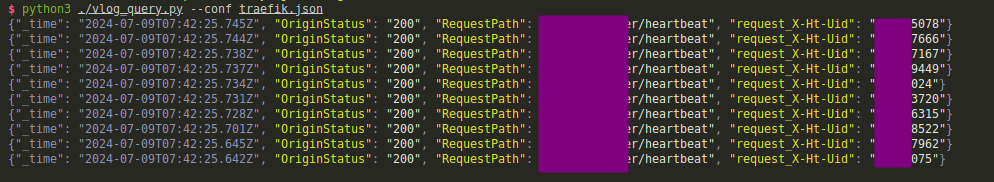

# Vlog Query Tool

[简体中文](README.zh.md) [English](README.md)



The Vlog Query Tool is a utility to query [vlogs (victorialogs)](https://docs.victoriametrics.com/victorialogs/) using a TOML configuration file and print the results in the terminal. This tool supports highlighting specified fields, formatting JSON output, copying to the clipboard when querying a single record, and using the Rich library for beautiful terminal output.

## Features

1. **Query vlogs using a TOML configuration file and print results in the terminal**.
2. **Support for highlighting specified fields**.
3. **Support for formatting JSON output**.
4. **Support for copying to the clipboard when querying a single record**.
5. **Using the Rich library for beautiful terminal output**.
6. **Support for printing only the query and request parameters (`only_print` parameter)**.

## Installation

Before using this tool, ensure you have installed the following Python libraries:

```sh
pip install requests pyperclip rich
```

## Usage Example

### Configuration File Example

Create a TOML configuration file, for example, `config.toml`:

```toml
topic = "example_topic"
caller = "*"
limit = 1
start_datetime = "2024-07-29T14:00:13+08:00"
end_datetime = "2024-07-29T16:50:13+08:00"
api_url = "https://your_domain/select/logsql/query"
time_sort_order = "desc"
query = "level:* _msg:log msg _msg:* caller:*"
only_print = true


_msg = ["handleUpdateVoiceManager debug count"]

fields = [
  "_msg",
  "userId",
  "example_field"
]
highlight_fields = [
  "userId",
  "RequestPath",
  "topic",
  "request_X-Ht-Uid",
  "OriginStatus",
  "caller",
  "_msg",
  "custom_field"
]

[customize]
[stream]
service = "example_service"

```

### Running the Script

```sh
python vlog_query.py --conf config.toml
```

## Configuration File Description

- `limit`: Query limit.
- `last_duration`: Duration, e.g., "5m" means the last 5 minutes.
- `fields`: List of fields to display.
- `highlight_fields`: List of fields to highlight.
- `api_url`: The query interface for vlogs.
- `_msg`: Message field, the log message printed by the code.
- `query`: Custom query statement.
- `only_print`: If `true`, only print the query and request parameters.

## Highlight Fields

In the configuration file, specify the fields to highlight using the `highlight_fields` field, for example:

```toml
highlight_fields = ["RequestPath", "topic", "request_X-Ht-Uid", "OriginStatus", "caller", "_msg", "custom_field"]
```

## Formatting JSON Output

When the query limit is set to 1, the script will format the JSON output and copy it to the clipboard.

## Using the Rich Library for Beautiful Terminal Output

The script uses the Rich library to achieve beautiful terminal output, supporting field highlighting and JSON formatting.
