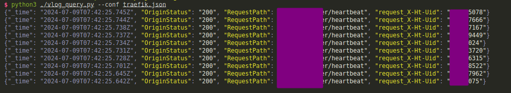

# Vlog Query Tool

[简体中文](README.zh.md) [English](README.md)



Vlog Query Tool 是一个使用 TOML 配置文件来查询 [vlogs(victorialogs)](https://docs.victoriametrics.com/victorialogs/) 并在终端打印结果的工具。此工具支持高亮指定字段、格式化输出 JSON、查询单条记录时复制到剪贴板，并且使用 Rich 库实现漂亮的终端输出。

## 功能

1. **使用 TOML 配置文件查询 vlogs 并打印在终端**。
2. **支持高亮指定字段**。
3. **支持格式化输出 JSON**。
4. **支持查询单条记录时复制到剪贴板**。
5. **使用 Rich 库实现漂亮的终端输出**。
6. **支持仅打印查询和请求参数（`only_print` 参数）**。

## 安装

在使用此工具之前，请确保您已安装以下 Python 库：

```sh
pip install requests pyperclip rich
```

## 使用示例

### 配置文件示例

创建一个 TOML 配置文件，例如 `config.toml`：

```toml
topic = "example_topic"
caller = "*"
limit = 1
start_datetime = "2024-07-29T14:00:13+08:00"
end_datetime = "2024-07-29T16:50:13+08:00"
api_url = "https://your_domain/select/logsql/query"
time_sort_order = "desc"
query = "level:* _msg:handleUpdateVoiceManager debug count _msg:* caller:*"
only_print = true

_msg = ["handleUpdateVoiceManager debug count"]

fields = [
  "_msg",
  "userId",
  "example_field"
]

highlight_fields = [
  "userId",
  "RequestPath",
  "topic",
  "request_X-Ht-Uid",
  "OriginStatus",
  "caller",
  "_msg",
  "custom_field"
]

[customize]
[stream]
service = "example_service"

```

### 运行脚本

```sh
python vlog_query.py --conf config.toml
```

## 配置文件说明

- `limit`: 查询限制。
- `last_duration`: 持续时间，例如 "5m" 表示过去 5 分钟。
- `fields`: 要显示的字段列表。
- `highlight_fields`: 需要高亮的字段列表。
- `api_url`: vlogs 的查询接口。
- `_msg`: 消息字段，代码日志打印的消息。
- `query`: 自定义查询语句。
- `only_print`: 如果为 `true`，则只打印查询语句和请求参数。

## 高亮字段

在配置文件中，通过 `highlight_fields` 字段指定需要高亮的字段，例如：

```toml
highlight_fields = ["RequestPath", "topic", "request_X-Ht-Uid", "OriginStatus", "caller", "_msg", "custom_field"]
```

## 格式化输出 JSON

当查询限制为 1 条记录时，脚本会格式化输出 JSON，并复制到剪贴板。

## 使用 Rich 库实现漂亮的终端输出

脚本使用 Rich 库来实现漂亮的终端输出，支持高亮字段和格式化 JSON。
```
